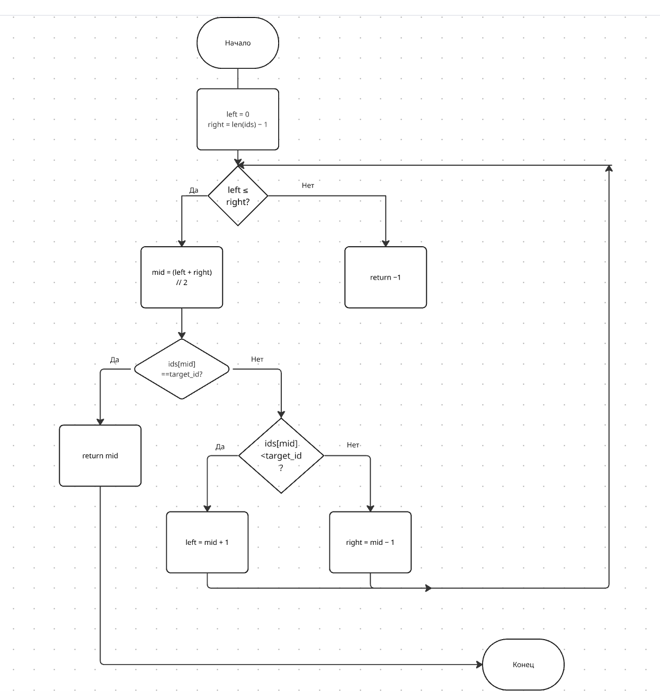
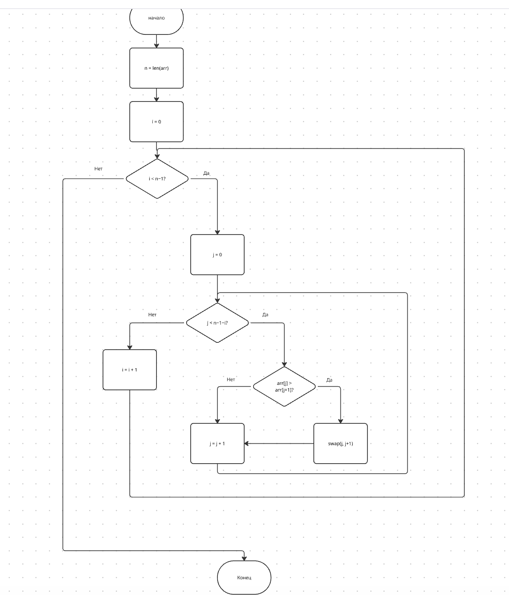

# Лабораторная работа 3

Харитонова Яна ЦИБ-251

---

## Описание

В работе реализованы два алгоритма:

- **Бинарный поиск** (`n4.py`) — поиск транзакции по ID в отсортированном массиве. Алгоритм делит массив пополам на каждом шаге и сравнивает средний элемент с целевым, пока не найдёт совпадение или не исчерпает область поиска. Сложность: O(log n).

- **Сортировка пузырьком** (`n6.py`) — сортировка массива путём последовательного сравнения и обмена соседних элементов. Каждый проход «всплывает» наибольший элемент в конец неотсортированной части. Сложность: O(n²).

---

## Блок-схемы

### Бинарный поиск (`n4.py`)



### Сортировка пузырьком (`n6.py`)



---

## Примеры запуска

### `n4.py` — бинарный поиск

```python
print(search_transaction([1001, 1005, 1010, 1025], 1010))  # 2
```

```
2
```

### `n6.py` — сортировка пузырьком

```python
a = [5, 2, 9, 1, 5, 6]
bubble_sort(a)
print(a)  # [1, 2, 5, 5, 6, 9]
```

```
[1, 2, 5, 5, 6, 9]
```

---

